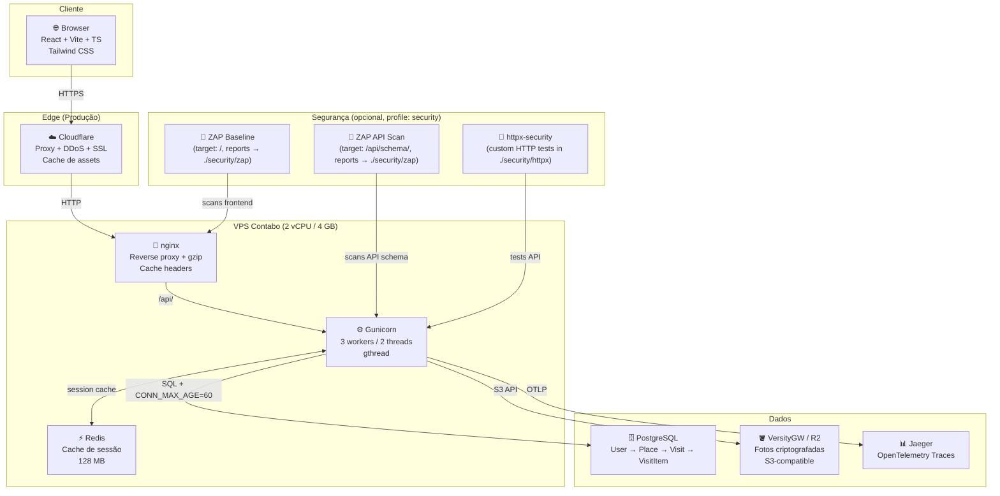

# 📍 Bora Ali

Um webapp de diário pessoal para rastrear lugares (cafés, restaurantes, bares, etc.) que você quer visitar ou visitou. Registre suas visitas, avalie ambiente/serviço/experiência, registre itens pedidos e navegue seu histórico.

## 🎯 Visão Geral

**Bora Ali** ajuda você a:
- ✅ Catalogar lugares que quer visitar ou já visitou
- ⭐ Avaliar ambiente, serviço e experiência geral
- 📸 Registrar itens que comeu ou bebeu
- 📚 Manter um histórico pessoal de suas experiências

## 🏗️ Arquitetura



### Stack Tecnológico

| Camada | Tecnologia |
|--------|-----------|
| **Frontend** | React 19 + Vite + TypeScript + Tailwind CSS |
| **Backend** | Django 5 + Django REST Framework + SimpleJWT |
| **Cache** | Redis 7 (session cache, throttling) |
| **Database** | PostgreSQL 16 (local) → Supabase (produção) |
| **Storage** | VersityGW (local) → Cloudflare R2 (produção) |
| **Observability** | Jaeger + OpenTelemetry + Sentry |
| **Auth** | JWT com refresh rotation + single-session por usuário |
| **Servidor** | Gunicorn gthread (3w × 2t) atrás de nginx |
| **Testing** | pytest (backend) + Vitest (frontend) + Playwright (E2E) |

## 🚀 Quick Start

### Pré-requisitos

- Python 3.8+
- Node.js 18+
- Docker & Docker Compose

### 1️⃣ Clonar o projeto

```bash
git clone <repository-url>
cd bora-ali
```

### 2️⃣ Configurar variáveis de ambiente

O projeto usa três modos:

| Modo | Uso | Base pública | API do frontend |
| --- | --- | --- | --- |
| `dev` | Debug local direto | `http://localhost:8080` ou `http://localhost:5173` | `http://localhost:8000/api` |
| `preprod` | Debug local exposto via ngrok | `https://seu-dominio.ngrok-free.dev` | `https://seu-dominio.ngrok-free.dev/api` |
| `prod` | Deploy real | domínio de produção | domínio de produção |

Templates prontos:

```bash
cp backend/.env.dev.example backend/.env
cp frontend/.env.development frontend/.env
```

Para preprod/ngrok:

```bash
cp backend/.env.preprod.example backend/.env
cp frontend/.env.preprod.example frontend/.env.preprod
```

Depois substitua `https://your-ngrok-domain.ngrok-free.dev` pelo domínio atual do ngrok em `PUBLIC_BASE_URL`, `AWS_S3_PUBLIC_URL`, `AWS_S3_PUBLIC_ENDPOINT`, `CORS_ALLOWED_ORIGINS`, `CSRF_TRUSTED_ORIGINS` e `VITE_PUBLIC_BASE_URL`.

Para produção:

```bash
cp backend/.env.prod.example backend/.env
cp frontend/.env.production.example frontend/.env.production
```

Preencha segredos reais antes de subir produção.

### 3️⃣ Iniciar serviços (PostgreSQL + Jaeger + VersityGW)

```bash
docker compose up -d
```

Isso inicia:
- **PostgreSQL**: porta `5432`
- **Jaeger UI**: `http://localhost:16686`
- **VersityGW S3 API**: `http://localhost:8081`
- **VersityGW WebGUI**: `http://localhost:8082`

### 4️⃣ Criar bucket no VersityGW

O bucket usado pelo Django é definido por `AWS_STORAGE_BUCKET_NAME=bora-ali` e precisa existir antes dos uploads.

```bash
export AWS_ACCESS_KEY_ID=minioadmin
export AWS_SECRET_ACCESS_KEY=minioadmin
export AWS_DEFAULT_REGION=us-east-1

aws \
  --endpoint-url http://localhost:8081 \
  --region us-east-1 \
  s3api create-bucket \
  --bucket bora-ali
```

Valide:

```bash
aws --endpoint-url http://localhost:8081 --region us-east-1 s3 ls
```

Não use `aws s3 mb` neste setup. O comando pode enviar `LocationConstraint` incompatível e retornar `InvalidLocationConstraint`.

### 5️⃣ Configurar Backend

```bash
cd backend

# Criar virtualenv
python -m venv .venv
source .venv/bin/activate  # Linux/Mac
# ou
.venv\Scripts\activate  # Windows

# Instalar dependências
pip install -r requirements.txt

# O backend usa as variáveis do .env da raiz ou do backend, conforme o loader do projeto.
# Se o projeto carregar backend/.env, copie os mesmos valores da raiz para backend/.env.

# Executar migrações
python manage.py migrate

# (Opcional) Criar superuser
python manage.py createsuperuser

# Iniciar servidor
python manage.py runserver
```

API estará em: `http://localhost:8000/api/`  
Docs Swagger: `http://localhost:8000/api/docs/`

### 6️⃣ Configurar Frontend

```bash
cd ../frontend

# Instalar dependências
npm install

# Iniciar dev server
npm run dev
```

Aplicação estará em: `http://localhost:5173`

Para rodar com bind local explícito:

```bash
npm run dev:local
```

Para debug via ngrok, use o modo `preprod`, suba o Caddy e exponha a porta `8080`.
No terminal do frontend:

```bash
npm run dev:preprod
```

Em outro terminal, na raiz do repositório:

```bash
caddy run --config Caddyfile
```

Em outro terminal, na raiz do repositório:

```bash
NGROK_DOMAIN=your-ngrok-domain.ngrok-free.dev scripts/ngrok-preprod.sh
```

O browser externo deve acessar a URL HTTPS do ngrok. O Caddy mantém uma origem única: frontend em `/`, API em `/api/`, admin em `/admin/` e mídia em `/bora-ali/`.

## ✨ Funcionalidades

- **Diário pessoal** — lugares com status (quer visitar / visitado / favorito / não volta)
- **Visitas** — avaliação de ambiente, serviço e experiência geral (0–10), fotos, notas
- **Consumíveis** — itens com nome, tipo, preço, avaliação e foto por visita
- **Fotos criptografadas** — armazenamento via VersityGW com criptografia Fernet por usuário; servidas autenticadas via `/api/media/<path>`
- **Single-session** — novo login invalida sessão anterior; banner amber exibido no frontend
- **Login social** — Google OAuth (`is_google_account=True`); troca de senha bloqueada para contas Google
- **Maps embed** — coordenadas extraídas automaticamente de URL do Google Maps; modal iframe sem API key
- **i18n** — PT-BR completo (backend gettext + frontend react-i18next)
- **Confirmação de exclusão** — dialog de confirmação antes de deletar lugar ou visita

## 📁 Estrutura do Projeto

```
bora-ali/
├── backend/                      # Django REST API
│   ├── config/                   # Configurações do projeto
│   │   ├── settings.py           # Django settings
│   │   ├── urls.py               # Rotas principais
│   │   ├── wsgi.py               # WSGI para produção
│   │   └── telemetry.py          # OpenTelemetry setup
│   ├── accounts/                 # Autenticação e usuários
│   │   ├── models.py             # User model (Django built-in)
│   │   ├── serializers.py        # Auth serializers
│   │   ├── views.py              # Auth viewsets
│   │   └── urls.py               # Auth endpoints
│   ├── places/                   # Lógica de lugares, visitas, itens
│   │   ├── models.py             # Place, Visit, VisitItem
│   │   ├── serializers.py        # Serializers para API
│   │   ├── viewsets.py           # ViewSets REST
│   │   ├── filters.py            # Filtros customizados
│   │   └── urls.py               # Places endpoints
│   ├── manage.py                 # Django CLI
│   ├── requirements.txt           # Dependências Python
│   └── .env.example               # Variáveis de exemplo
│
├── frontend/                     # React SPA
│   ├── src/
│   │   ├── routes/               # Páginas principais
│   │   │   ├── LoginPage.tsx      # Autenticação
│   │   │   ├── PlacesPage.tsx     # Lista de lugares
│   │   │   ├── PlaceDetailPage.tsx # Detalhes de lugar
│   │   │   └── ...
│   │   ├── components/
│   │   │   ├── ui/               # Componentes reutilizáveis
│   │   │   ├── auth/             # Protected/Public routes
│   │   │   ├── places/           # Componentes de lugares
│   │   │   ├── visits/           # Componentes de visitas
│   │   │   └── feedback/         # Loading, Empty, Error states
│   │   ├── services/
│   │   │   ├── api.ts            # Axios client com interceptadores
│   │   │   ├── auth.ts           # Auth service
│   │   │   └── places.ts         # Places service
│   │   ├── types/                # TypeScript interfaces
│   │   ├── utils/                # Constantes, formatters, validators
│   │   └── App.tsx               # Entry point
│   ├── index.html
│   ├── package.json
│   └── vite.config.ts
│
├── docs/                         # Documentação adicional
├── docker-compose.yml            # Orquestração de serviços
├── Caddyfile                     # Reverse proxy (produção)
├── CLAUDE.md                     # Guia para LLM
├── skills.md                     # Especificação MVP detalhada
└── README.md                     # Este arquivo
```

## 🔐 Autenticação

A API usa **SimpleJWT** com refresh token rotation:

- **Register**: `POST /api/auth/register/`
- **Login**: `POST /api/auth/login/`
- **Refresh Token**: `POST /api/auth/refresh/`
- **Logout**: `POST /api/auth/logout/` (blacklista o token)
- **Meu Perfil**: `GET /api/auth/me/`
- **Google Login**: `POST /api/auth/google/` com `id_token`

Para habilitar o login social, defina `GOOGLE_OAUTH_CLIENT_ID` no backend e
`VITE_GOOGLE_OAUTH_CLIENT_ID` no frontend com o mesmo client id do Google
Cloud Console.

Todos os requests autenticados incluem o header:
```
Authorization: Bearer <access_token>
```

Rate limit: **10 requisições/minuto** em endpoints de auth.

## 📊 Modelo de Dados

```
┌─────────────┐
│    User     │
│  (Django)   │
└──────┬──────┘
       │ 1:N
       │
       ▼
┌──────────────────┐
│      Place       │ (name, description, address, rating)
│   user_id (FK)   │
└──────┬───────────┘
       │ 1:N
       │
       ▼
┌──────────────────┐
│      Visit       │ (date, rating_env, rating_service, rating_exp)
│  place_id (FK)   │
└──────┬───────────┘
       │ 1:N
       │
       ▼
┌──────────────────┐
│    VisitItem     │ (description, price)
│   visit_id (FK)  │
└──────────────────┘
```

### Regras Importantes

- ✅ **Propriedade**: Cada usuário só vê seus próprios dados
- ✅ **Ratings**: Escala 0-10 (inteiros)
- ✅ **Arquivos/Fotos**: armazenamento via VersityGW usando API S3-compatible e persistência POSIX local
- ✅ **Paginação**: Todos os endpoints de lista retornam 20 itens/página

## 🐳 Docker Compose

O `docker-compose.yml` da raiz sobe todos os serviços: frontend, backend, postgres, **redis**, VersityGW e Jaeger.

Além desses serviços principais, há uma camada de segurança definida no mesmo `docker-compose.yml` sob o profile `security`. Essa camada inclui três jobs opcionais:

- `zap-api-scan` — executa um scan do OpenAPI (target padrão `http://frontend/api/schema/`) e gera `zap-api-report.html` e `zap-api-report.json` em `./security/zap`.
- `zap-baseline` — executa um scan baseline do frontend (target padrão `http://frontend`) e gera `zap-baseline-report.html` em `./security/zap`.
- `httpx-security` — roda testes HTTP personalizados contidos em `./security/httpx` (pip install + python run_tests.py) e imprime os resultados.

Observações importantes:
- Serviços com `profiles: ["security"]` NÃO são iniciados por padrão com `docker compose up -d`. Eles são jobs/scan e costumam terminar (Exit) depois de gerar relatórios — por isso podem aparecer como `Exited` em vez de `Up`.
- Os relatórios são gravados no diretório da raiz `./security` (bind mount no compose). Garanta que `security/zap` exista e seja gravável.

Como executar os scanners manualmente (modo foreground para ver logs):
```/dev/null/cmd.sh#L1-6
# Rodar zap-api-scan (executa e retorna quando terminar)
docker compose --profile security run --rm zap-api-scan

# Rodar zap-baseline
docker compose --profile security run --rm zap-baseline

# Rodar httpx-security
docker compose --profile security run --rm httpx-security
```

Se preferir que esses serviços subam junto com o stack por padrão, remova a chave `profiles` das definições no `docker-compose.yml` ou sempre use `--profile security` ao subir o conjunto de serviços.

```yaml
version: "3.9"

services:
  db:
    image: postgres:16
    restart: unless-stopped
    environment:
      POSTGRES_DB: ${POSTGRES_DB}
      POSTGRES_USER: ${POSTGRES_USER}
      POSTGRES_PASSWORD: ${POSTGRES_PASSWORD}
    ports:
      - "5432:5432"
    volumes:
      - bora_ali_pgdata:/var/lib/postgresql/data

  jaeger:
    image: jaegertracing/all-in-one:1.57
    restart: unless-stopped
    ports:
      - "16686:16686"
      - "4318:4318"
    environment:
      COLLECTOR_OTLP_ENABLED: "true"

  storage:
    image: ghcr.io/versity/versitygw:v1.4.1
    restart: unless-stopped
    ports:
      - "8081:7070" # S3 API
      - "8082:7071" # WebGUI
    environment:
      ROOT_ACCESS_KEY: ${VERSITYGW_ACCESS_KEY}
      ROOT_SECRET_KEY: ${VERSITYGW_SECRET_KEY}

      VGW_PORT: ":7070"
      VGW_BACKEND: posix
      VGW_BACKEND_ARGS: /data

      VGW_WEBUI_PORT: ":7071"
      VGW_WEBUI_NO_TLS: "true"

      # Necessário para a WebGUI conversar com o endpoint S3
      VGW_CORS_ALLOW_ORIGIN: "*"

    volumes:
      - bora_ali_storage:/data

volumes:
  bora_ali_pgdata:
  bora_ali_storage:
```

### Endpoints locais

| Serviço | URL | Uso |
|--------|-----|-----|
| Frontend | `http://localhost` | SPA React |
| API | `http://localhost/api/` | Django via nginx |
| Health check | `http://localhost/api/health/` | `{"status":"ok"}` sem auth |
| Jaeger | `http://localhost:16686` | Visualização de traces |
| VersityGW S3 API | `http://localhost:8081` | Endpoint S3 (boto3) |
| VersityGW WebGUI | `http://localhost:8082` | Interface web do storage |

A tela `AccessDenied` em `http://localhost:8081/` é esperada — essa porta é a API S3, não a WebGUI.


## 🛠️ Comandos Essenciais

### Storage / VersityGW

```bash
# Subir somente storage
docker compose up -d storage

# Logs do storage
docker compose logs -f storage

# Criar bucket usado pelo Django
export AWS_ACCESS_KEY_ID=minioadmin
export AWS_SECRET_ACCESS_KEY=minioadmin
export AWS_DEFAULT_REGION=us-east-1

aws --endpoint-url http://localhost:8081 --region us-east-1 s3api create-bucket --bucket bora-ali

# Listar buckets
aws --endpoint-url http://localhost:8081 --region us-east-1 s3 ls

# Upload de teste
echo "teste" > teste.txt
aws --endpoint-url http://localhost:8081 --region us-east-1 s3 cp teste.txt s3://bora-ali/teste.txt
aws --endpoint-url http://localhost:8081 --region us-east-1 s3 ls s3://bora-ali/
```

### Backend

```bash
cd backend
source .venv/bin/activate

# Servidor de desenvolvimento
python manage.py runserver

# Migrações
python manage.py makemigrations
python manage.py migrate

# Testes
pytest                    # Todos
pytest accounts/          # App específico
pytest -k test_name       # Teste específico

# Qualidade de código
black .                   # Formatter
isort .                   # Organiza imports
flake8                    # Linter
```

### Frontend

```bash
cd frontend

# Dev server (com hot reload)
npm run dev

# Build para produção
npm run build

# Executar testes
npm run test
npm run test:watch       # Watch mode

# Lint
npm run lint

# E2E (Playwright)
npm run test:e2e
```

## 📡 OpenTelemetry (Observability)

Para ativar tracing, adicione ao `backend/.env`:

```env
OTEL_SERVICE_NAME=bora-ali
OTEL_EXPORTER_OTLP_ENDPOINT=http://localhost:4318/v1/traces
```

O sistema rastreia automaticamente:
- ✅ Requests HTTP (Django)
- ✅ Queries SQL (psycopg)
- ✅ Logs correlacionados

**Jaeger UI**: `http://localhost:16686`

## 🎨 Visual Identity

- **Cor primária**: `#EA1D2C` (vermelho)
- **Background**: `#FAFAFA` (branco off)
- **Layout**: Mobile-first
- **Cards**: Rounded corners + light shadow

## 📚 Endpoints da API

### Autenticação

| Método | Endpoint | Descrição |
|--------|----------|-----------|
| POST | `/api/auth/register/` | Registrar novo usuário |
| POST | `/api/auth/login/` | Login (retorna access + refresh token) |
| POST | `/api/auth/refresh/` | Renovar access token |
| POST | `/api/auth/logout/` | Logout (blacklista refresh token) |
| GET | `/api/auth/me/` | Dados do usuário autenticado |

### Lugares

| Método | Endpoint | Descrição |
|--------|----------|-----------|
| GET | `/api/places/` | Listar meus lugares (paginado) |
| POST | `/api/places/` | Criar novo lugar |
| GET | `/api/places/{public_id}/` | Detalhes de um lugar |
| PATCH | `/api/places/{public_id}/` | Editar lugar |
| DELETE | `/api/places/{public_id}/` | Deletar lugar |
| GET | `/api/places/{public_id}/visits/` | Listar visitas de um lugar |
| POST | `/api/places/{public_id}/visits/` | Registrar visita |

### Visitas

| Método | Endpoint | Descrição |
|--------|----------|-----------|
| GET | `/api/visits/{public_id}/` | Detalhes de uma visita |
| PATCH | `/api/visits/{public_id}/` | Editar visita |
| DELETE | `/api/visits/{public_id}/` | Deletar visita |
| GET | `/api/visits/{public_id}/items/` | Listar itens |
| POST | `/api/visits/{public_id}/items/` | Criar item (comida/bebida) |
| PATCH | `/api/visits/{public_id}/items/{public_id}/` | Editar item |
| DELETE | `/api/visits/{public_id}/items/{public_id}/` | Deletar item |

### Media (imagens autenticadas)

| Método | Endpoint | Descrição |
|--------|----------|-----------|
| GET | `/api/media/{path}` | Servir imagem descriptografada (JWT obrigatório) |

## 🧪 Testes

### Backend

```bash
cd backend
source .venv/bin/activate

# Rodar todos os testes
pytest

# Com cobertura
pytest --cov=.

# Apenas um arquivo/módulo
pytest accounts/tests/test_auth.py

# Modo verbose
pytest -v
```

### Frontend

```bash
cd frontend

# Rodar testes uma vez
npm run test

# Watch mode
npm run test:watch

# Cobertura
npm run test -- --coverage
```

### E2E (Playwright)

```bash
cd frontend

# Todos os specs (requer backend + dev server na porta 8181)
npx playwright test

# Apenas specs com mock (sem backend)
npx playwright test auth-negative crud-negative responsive

# Rodar dev server na porta correta
npm run dev -- --port 8181
```

## 📦 Deployment

### Stack de produção

```
GoDaddy (domínio) → Cloudflare (proxy / DDoS / SSL)
  → Contabo VPS (2 vCPU / 4 GB)
      ├── nginx (reverse proxy + gzip + cache headers)
      ├── Gunicorn (3 workers, 2 threads, gthread)
      ├── Redis (cache de sessão, 128 MB)
      └── Sentry (error tracking)
  → Supabase (PostgreSQL via PgBouncer porta 6543)
  → Cloudflare R2 (storage de fotos)
```

### Checklist antes de subir

- [ ] `DJANGO_SECRET_KEY` forte (50+ chars)
- [ ] `DJANGO_DEBUG=False` (já é o default — não precisa setar)
- [ ] `POSTGRES_HOST` e `POSTGRES_PORT=6543` (PgBouncer Supabase)
- [ ] `REDIS_URL=redis://127.0.0.1:6379/1`
- [ ] `PUBLIC_BASE_URL=https://seudominio.com`
- [ ] Cloudflare: proxy ligado (laranja), SSL Full Strict, Page Rule `/api/*` → Bypass Cache
- [ ] `GOOGLE_OAUTH_CLIENT_ID` e `VITE_GOOGLE_OAUTH_CLIENT_ID` se usar OAuth

### Load test

```bash
# Criar usuários de teste
docker exec -it bora-ali-backend-1 python manage.py create_load_test_users 100

# Rodar (15 minutos, 100 usuários)
locust -f locustfile_realistic.py --host=http://localhost \
  --users 100 --spawn-rate 5 --run-time 15m --headless \
  --csv=load-tests/results/realistic-100
```

Resultados baseline (local): 0% falhas, median 22ms, p95 55ms com 100 usuários.

## ❌ Fora do MVP

Os seguintes não serão implementados nesta fase:

- ❌ Microserviços
- ❌ Filas/Workers assíncronos
- ❌ WebSockets
- ❌ Redes sociais (likes, comments, seguir)
- ❌ Google Places API
- ❌ Upload público sem autenticação
- ❌ Integração Instagram
- ❌ Pagamentos
- ❌ PWA / App stores
- ❌ Facebook OAuth, Apple OAuth

## 📖 Documentação Adicional

- **`CLAUDE.md`**: Guia para desenvolvimento com IA
- **`skills.md`**: Especificação completa do MVP

## 🤝 Contribuindo

1. Crie uma branch para sua feature: `git checkout -b feature/minha-feature`
2. Faça commit das mudanças: `git commit -am 'Add minha feature'`
3. Push para a branch: `git push origin feature/minha-feature`
4. Abra um Pull Request

---

**Desenvolvido com ❤️**
