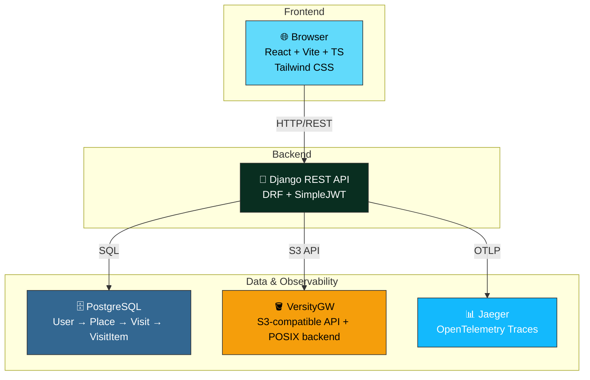

# 📍 Bora Ali

Um webapp de diário pessoal para rastrear lugares (cafés, restaurantes, bares, etc.) que você quer visitar ou visitou. Registre suas visitas, avalie ambiente/serviço/experiência, registre itens pedidos e navegue seu histórico.

## 🎯 Visão Geral

**Bora Ali** ajuda você a:
- ✅ Catalogar lugares que quer visitar ou já visitou
- ⭐ Avaliar ambiente, serviço e experiência geral
- 📸 Registrar itens que comeu ou bebeu
- 📚 Manter um histórico pessoal de suas experiências

## 🏗️ Arquitetura



### Stack Tecnológico

| Camada | Tecnologia |
|--------|-----------|
| **Frontend** | React 19 + Vite + TypeScript + Tailwind CSS |
| **Backend** | Django 5 + Django REST Framework + SimpleJWT |
| **Database** | PostgreSQL 16 |
| **Storage** | VersityGW v1.4.1 + backend POSIX + API S3-compatible |
| **Observability** | Jaeger + OpenTelemetry |
| **Auth** | JWT com refresh token rotation |
| **Testing** | pytest (backend) + Vitest (frontend) |

## 🚀 Quick Start

### Pré-requisitos

- Python 3.8+
- Node.js 18+
- Docker & Docker Compose

### 1️⃣ Clonar o projeto

```bash
git clone <repository-url>
cd bora-ali
```

### 2️⃣ Configurar variáveis de ambiente

Crie um arquivo `.env` na raiz do projeto, na mesma pasta do `docker-compose.yml`:

```env
DJANGO_SECRET_KEY=changeme
DJANGO_DEBUG=True

DJANGO_ALLOWED_HOSTS=localhost,127.0.0.1,favored-scalded-tusk.ngrok-free.dev

POSTGRES_DB=bora_ali
POSTGRES_USER=bora
POSTGRES_PASSWORD=bora
POSTGRES_HOST=localhost
POSTGRES_PORT=5432

CORS_ALLOWED_ORIGINS=http://localhost:5173,http://localhost:8080,https://favored-scalded-tusk.ngrok-free.dev
CSRF_TRUSTED_ORIGINS=http://localhost:5173,http://localhost:8080,https://favored-scalded-tusk.ngrok-free.dev

USE_VERSITYGW=True

AWS_ACCESS_KEY_ID=minioadmin
AWS_SECRET_ACCESS_KEY=minioadmin
AWS_STORAGE_BUCKET_NAME=bora-ali
AWS_S3_REGION_NAME=us-east-1
AWS_DEFAULT_REGION=us-east-1
AWS_S3_ENDPOINT_URL=http://localhost:8081
AWS_S3_ADDRESSING_STYLE=path
AWS_S3_SIGNATURE_VERSION=s3v4
AWS_DEFAULT_ACL=

VERSITYGW_ACCESS_KEY=minioadmin
VERSITYGW_SECRET_KEY=minioadmin
```

### 3️⃣ Iniciar serviços (PostgreSQL + Jaeger + VersityGW)

```bash
docker compose up -d
```

Isso inicia:
- **PostgreSQL**: porta `5432`
- **Jaeger UI**: `http://localhost:16686`
- **VersityGW S3 API**: `http://localhost:8081`
- **VersityGW WebGUI**: `http://localhost:8082`

### 4️⃣ Criar bucket no VersityGW

O bucket usado pelo Django é definido por `AWS_STORAGE_BUCKET_NAME=bora-ali` e precisa existir antes dos uploads.

```bash
export AWS_ACCESS_KEY_ID=minioadmin
export AWS_SECRET_ACCESS_KEY=minioadmin
export AWS_DEFAULT_REGION=us-east-1

aws \
  --endpoint-url http://localhost:8081 \
  --region us-east-1 \
  s3api create-bucket \
  --bucket bora-ali
```

Valide:

```bash
aws --endpoint-url http://localhost:8081 --region us-east-1 s3 ls
```

Não use `aws s3 mb` neste setup. O comando pode enviar `LocationConstraint` incompatível e retornar `InvalidLocationConstraint`.

### 5️⃣ Configurar Backend

```bash
cd backend

# Criar virtualenv
python -m venv .venv
source .venv/bin/activate  # Linux/Mac
# ou
.venv\Scripts\activate  # Windows

# Instalar dependências
pip install -r requirements.txt

# O backend usa as variáveis do .env da raiz ou do backend, conforme o loader do projeto.
# Se o projeto carregar backend/.env, copie os mesmos valores da raiz para backend/.env.

# Executar migrações
python manage.py migrate

# (Opcional) Criar superuser
python manage.py createsuperuser

# Iniciar servidor
python manage.py runserver
```

API estará em: `http://localhost:8000/api/`  
Docs Swagger: `http://localhost:8000/api/docs/`

### 6️⃣ Configurar Frontend

```bash
cd ../frontend

# Instalar dependências
npm install

# Iniciar dev server
npm run dev
```

Aplicação estará em: `http://localhost:5173`

## 🆕 Atualizações Recentes (Frontend)

As últimas melhorias focaram em performance inicial, SEO técnico e acessibilidade do fluxo de login.

### Performance (Lighthouse)

- Adicionado `lighthouse` no frontend e scripts dedicados:
  - `npm run perf:preview`
  - `npm run perf:lighthouse:mobile`
  - `npm run perf:lighthouse:desktop`
- Implementado code-splitting de rotas com `React.lazy` + `Suspense` em `frontend/src/App.tsx`.
- Resultado prático: redução de JS não utilizado no mobile (`/login`) de ~`109 KiB` para ~`32 KiB` (estimado pelo Lighthouse), mantendo `performance` em ~`0.99`.

### SEO

- Adicionado `frontend/public/robots.txt`.
- Adicionada `meta description` em `frontend/index.html`.
- Score de SEO no mobile (`/login`) passou para `1.00` na última validação.

### Acessibilidade

- Ajustes de contraste no login (tipografia e cor primária).
- Score de acessibilidade no mobile (`/login`) passou para `1.00`.

### Observação de Fontes

- Removida dependência de stylesheet remota de Google Fonts no `index.html`.
- Frontend agora usa stack de fontes do sistema (fallback local), reduzindo recurso externo render-blocking.

## 📁 Estrutura do Projeto

```
bora-ali/
├── backend/                      # Django REST API
│   ├── config/                   # Configurações do projeto
│   │   ├── settings.py           # Django settings
│   │   ├── urls.py               # Rotas principais
│   │   ├── wsgi.py               # WSGI para produção
│   │   └── telemetry.py          # OpenTelemetry setup
│   ├── accounts/                 # Autenticação e usuários
│   │   ├── models.py             # User model (Django built-in)
│   │   ├── serializers.py        # Auth serializers
│   │   ├── views.py              # Auth viewsets
│   │   └── urls.py               # Auth endpoints
│   ├── places/                   # Lógica de lugares, visitas, itens
│   │   ├── models.py             # Place, Visit, VisitItem
│   │   ├── serializers.py        # Serializers para API
│   │   ├── viewsets.py           # ViewSets REST
│   │   ├── filters.py            # Filtros customizados
│   │   └── urls.py               # Places endpoints
│   ├── manage.py                 # Django CLI
│   ├── requirements.txt           # Dependências Python
│   └── .env.example               # Variáveis de exemplo
│
├── frontend/                     # React SPA
│   ├── src/
│   │   ├── routes/               # Páginas principais
│   │   │   ├── LoginPage.tsx      # Autenticação
│   │   │   ├── PlacesPage.tsx     # Lista de lugares
│   │   │   ├── PlaceDetailPage.tsx # Detalhes de lugar
│   │   │   └── ...
│   │   ├── components/
│   │   │   ├── ui/               # Componentes reutilizáveis
│   │   │   ├── auth/             # Protected/Public routes
│   │   │   ├── places/           # Componentes de lugares
│   │   │   ├── visits/           # Componentes de visitas
│   │   │   └── feedback/         # Loading, Empty, Error states
│   │   ├── services/
│   │   │   ├── api.ts            # Axios client com interceptadores
│   │   │   ├── auth.ts           # Auth service
│   │   │   └── places.ts         # Places service
│   │   ├── types/                # TypeScript interfaces
│   │   ├── utils/                # Constantes, formatters, validators
│   │   └── App.tsx               # Entry point
│   ├── index.html
│   ├── package.json
│   └── vite.config.ts
│
├── docs/                         # Documentação adicional
├── docker-compose.yml            # Orquestração de serviços
├── Caddyfile                     # Reverse proxy (produção)
├── CLAUDE.md                     # Guia para LLM
├── skills.md                     # Especificação MVP detalhada
└── README.md                     # Este arquivo
```

## 🔐 Autenticação

A API usa **SimpleJWT** com refresh token rotation:

- **Register**: `POST /api/auth/register/`
- **Login**: `POST /api/auth/login/`
- **Refresh Token**: `POST /api/auth/refresh/`
- **Logout**: `POST /api/auth/logout/` (blacklista o token)
- **Meu Perfil**: `GET /api/auth/me/`

Todos os requests autenticados incluem o header:
```
Authorization: Bearer <access_token>
```

Rate limit: **10 requisições/minuto** em endpoints de auth.

## 📊 Modelo de Dados

```
┌─────────────┐
│    User     │
│  (Django)   │
└──────┬──────┘
       │ 1:N
       │
       ▼
┌──────────────────┐
│      Place       │ (name, description, address, rating)
│   user_id (FK)   │
└──────┬───────────┘
       │ 1:N
       │
       ▼
┌──────────────────┐
│      Visit       │ (date, rating_env, rating_service, rating_exp)
│  place_id (FK)   │
└──────┬───────────┘
       │ 1:N
       │
       ▼
┌──────────────────┐
│    VisitItem     │ (description, price)
│   visit_id (FK)  │
└──────────────────┘
```

### Regras Importantes

- ✅ **Propriedade**: Cada usuário só vê seus próprios dados
- ✅ **Ratings**: Escala 0-10 (inteiros)
- ✅ **Arquivos/Fotos**: armazenamento via VersityGW usando API S3-compatible e persistência POSIX local
- ✅ **Paginação**: Todos os endpoints de lista retornam 20 itens/página

## 🐳 Docker Compose

O `docker-compose.yml` da raiz sobe PostgreSQL, Jaeger e VersityGW. O VersityGW expõe API S3-compatible na porta `8081` e WebGUI na porta `8082`, persistindo dados em backend POSIX no volume `bora_ali_storage`.

```yaml
version: "3.9"

services:
  db:
    image: postgres:16
    restart: unless-stopped
    environment:
      POSTGRES_DB: ${POSTGRES_DB}
      POSTGRES_USER: ${POSTGRES_USER}
      POSTGRES_PASSWORD: ${POSTGRES_PASSWORD}
    ports:
      - "5432:5432"
    volumes:
      - bora_ali_pgdata:/var/lib/postgresql/data

  jaeger:
    image: jaegertracing/all-in-one:1.57
    restart: unless-stopped
    ports:
      - "16686:16686"
      - "4318:4318"
    environment:
      COLLECTOR_OTLP_ENABLED: "true"

  storage:
    image: ghcr.io/versity/versitygw:v1.4.1
    restart: unless-stopped
    ports:
      - "8081:7070" # S3 API
      - "8082:7071" # WebGUI
    environment:
      ROOT_ACCESS_KEY: ${VERSITYGW_ACCESS_KEY}
      ROOT_SECRET_KEY: ${VERSITYGW_SECRET_KEY}

      VGW_PORT: ":7070"
      VGW_BACKEND: posix
      VGW_BACKEND_ARGS: /data

      VGW_WEBUI_PORT: ":7071"
      VGW_WEBUI_NO_TLS: "true"

      # Necessário para a WebGUI conversar com o endpoint S3
      VGW_CORS_ALLOW_ORIGIN: "*"

    volumes:
      - bora_ali_storage:/data

volumes:
  bora_ali_pgdata:
  bora_ali_storage:
```

### Endpoints locais

| Serviço | URL | Uso |
|--------|-----|-----|
| PostgreSQL | `localhost:5432` | Banco de dados local |
| Jaeger | `http://localhost:16686` | Visualização de traces |
| VersityGW S3 API | `http://localhost:8081` | Endpoint usado pelo Django/boto3 |
| VersityGW WebGUI | `http://localhost:8082` | Interface web do storage |

A tela `AccessDenied` em `http://localhost:8081/` é esperada, porque essa porta é a API S3. A interface web fica em `http://localhost:8082`.


## 🛠️ Comandos Essenciais

### Storage / VersityGW

```bash
# Subir somente storage
docker compose up -d storage

# Logs do storage
docker compose logs -f storage

# Criar bucket usado pelo Django
export AWS_ACCESS_KEY_ID=minioadmin
export AWS_SECRET_ACCESS_KEY=minioadmin
export AWS_DEFAULT_REGION=us-east-1

aws --endpoint-url http://localhost:8081 --region us-east-1 s3api create-bucket --bucket bora-ali

# Listar buckets
aws --endpoint-url http://localhost:8081 --region us-east-1 s3 ls

# Upload de teste
echo "teste" > teste.txt
aws --endpoint-url http://localhost:8081 --region us-east-1 s3 cp teste.txt s3://bora-ali/teste.txt
aws --endpoint-url http://localhost:8081 --region us-east-1 s3 ls s3://bora-ali/
```

### Backend

```bash
cd backend
source .venv/bin/activate

# Servidor de desenvolvimento
python manage.py runserver

# Migrações
python manage.py makemigrations
python manage.py migrate

# Testes
pytest                    # Todos
pytest accounts/          # App específico
pytest -k test_name       # Teste específico

# Qualidade de código
black .                   # Formatter
isort .                   # Organiza imports
flake8                    # Linter
```

### Frontend

```bash
cd frontend

# Dev server (com hot reload)
npm run dev

# Build para produção
npm run build

# Executar testes
npm run test
npm run test:watch       # Watch mode

# Lint
npm run lint

# E2E (Playwright)
npm run test:e2e
```

## 📡 OpenTelemetry (Observability)

Para ativar tracing, adicione ao `backend/.env`:

```env
OTEL_SERVICE_NAME=bora-ali
OTEL_EXPORTER_OTLP_ENDPOINT=http://localhost:4318/v1/traces
```

O sistema rastreia automaticamente:
- ✅ Requests HTTP (Django)
- ✅ Queries SQL (psycopg)
- ✅ Logs correlacionados

**Jaeger UI**: `http://localhost:16686`

## 🎨 Visual Identity

- **Cor primária**: `#EA1D2C` (vermelho)
- **Background**: `#FAFAFA` (branco off)
- **Layout**: Mobile-first
- **Cards**: Rounded corners + light shadow

## 📚 Endpoints da API

### Autenticação

| Método | Endpoint | Descrição |
|--------|----------|-----------|
| POST | `/api/auth/register/` | Registrar novo usuário |
| POST | `/api/auth/login/` | Login (retorna access + refresh token) |
| POST | `/api/auth/refresh/` | Renovar access token |
| POST | `/api/auth/logout/` | Logout (blacklista refresh token) |
| GET | `/api/auth/me/` | Dados do usuário autenticado |

### Lugares

| Método | Endpoint | Descrição |
|--------|----------|-----------|
| GET | `/api/places/` | Listar meus lugares |
| POST | `/api/places/` | Criar novo lugar |
| GET | `/api/places/{id}/` | Detalhes de um lugar |
| PUT | `/api/places/{id}/` | Editar lugar |
| DELETE | `/api/places/{id}/` | Deletar lugar |
| GET | `/api/places/{id}/visits/` | Listar visitas de um lugar |

### Visitas

| Método | Endpoint | Descrição |
|--------|----------|-----------|
| POST | `/api/places/{id}/visits/` | Registrar visita em um lugar |
| GET | `/api/visits/{id}/` | Detalhes de uma visita |
| PUT | `/api/visits/{id}/` | Editar visita |
| DELETE | `/api/visits/{id}/` | Deletar visita |

### Itens de Visita

| Método | Endpoint | Descrição |
|--------|----------|-----------|
| GET | `/api/visits/{id}/items/` | Listar itens de uma visita |
| POST | `/api/visits/{id}/items/` | Criar item (comida/bebida) |
| PUT | `/api/visits/{visit_id}/items/{item_id}/` | Editar item |
| DELETE | `/api/visits/{visit_id}/items/{item_id}/` | Deletar item |

## 🧪 Testes

### Backend

```bash
cd backend
source .venv/bin/activate

# Rodar todos os testes
pytest

# Com cobertura
pytest --cov=.

# Apenas um arquivo/módulo
pytest accounts/tests/test_auth.py

# Modo verbose
pytest -v
```

### Frontend

```bash
cd frontend

# Rodar testes uma vez
npm run test

# Watch mode
npm run test:watch

# Cobertura
npm run test -- --coverage
```

## 📦 Deployment

O projeto inclui `Caddyfile` para produção com reverse proxy. Consulte documentação adicional em `docs/`.

## ❌ Fora do MVP

Os seguintes não serão implementados nesta fase:

- ❌ Microserviços
- ❌ Filas/Workers assíncronos
- ❌ WebSockets
- ❌ Redes sociais (likes, comments, seguir)
- ❌ Geolocalização
- ❌ Google Places API
- ❌ Upload público sem autenticação
- ❌ Integração Instagram
- ❌ Pagamentos
- ❌ PWA
- ❌ App stores
- ❌ OAuth (Google, Facebook)

## 📖 Documentação Adicional

- **`CLAUDE.md`**: Guia para desenvolvimento com IA
- **`skills.md`**: Especificação completa do MVP

## 🤝 Contribuindo

1. Crie uma branch para sua feature: `git checkout -b feature/minha-feature`
2. Faça commit das mudanças: `git commit -am 'Add minha feature'`
3. Push para a branch: `git push origin feature/minha-feature`
4. Abra um Pull Request

---

**Desenvolvido com ❤️**
